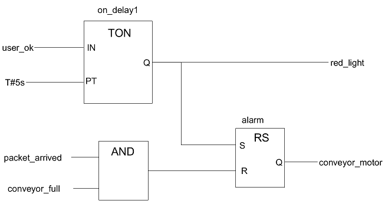

# **Zadanie**
### ICP projekt - varianta 2: Editor a interpret hierarchicky strukturovaných funkčních bloků

*   Editor - uvažujte diagramy funkčních bloků: 
    (Jde o příklad pro inspiraci, veškeré detaily, které nejsou specifikovány níže, si dospecifikujte sami.)
    *   Umožněte editaci atomických bloků, které mají 0-m vstupních a 0-n výstupních pojmenovaných portů a jsou specifikovány obecným víceřádkovým textem (editor nekontrojuje syntax, ale počítejte s C/C++). Každý takový blok má jméno a je chápán jako instanciovatelný typ, který je součástí knihovny typů bloků.
    *   Umožněte editaci kompozitních bloků, které mají 0-m vstupních a 0-n výstupních pojmenovaných portů a jsou specifikovány propojením pojmenovaných instancí existujících typů bloků z knihovny (implicitní jméno je číslo instance, lze ho uživatelsky přejmenovat). Propojky propojují výstupy bloků na vstupy bloků, výstup může být připojen na více vstupů a na vstup může být připojeno víc výstupů. Porty kompozitu mou být připojeny na vstupy vnitřních bloků, výstupy vnitřních bloků kompozitu mohou být připojeny na jeho výstupní porty. Propojení bloků může tvořit cyklické struktury.  
        Kompozitní bloky jsou také knihovní typy.
    *   Editor umožní zobrazit obsah knihovny. Knihovna typů bloků by měla být strukturována do kategorií. Kategorie lze přidávat, přejmenovávat, rušit. Součástí specifikace typu bloku je i kategorie. Knihovna je perzistentní (definujte způsob uložení do souboru).
    *   Umožněte editaci aplikací, což jsou speciální případy kompozitních bloků bez portů, které nemohou být použity jako instanciovatelné typy a nejsou součástí knihovny typů, ale jsou součástí knihovny aplikací.
    *   Vizuálně je každá instance bloku obdélník. Záhlaví zobrazuje typ a jméno instance (pokud je zadáno; číslo instance není potřeba zobrazovat, ale je k dispozici v rámci dialogu pro pojmenování a parametrizaci instance), vlevo jsou pojmenované vstupní porty, vpravo jsou pojmenované výstupní porty. U bloků se zaměnitelnými vstupy a jedním výstupem (např. AND, OR apod) není nutné porty pojmenovávat (kód bloku se na ně může odkazovat číslem).
    *   Některé nepřipojené vst. porty mohou mít nastavený konstantní vstup (string) - takovéto parametry lze specifikovat např. v rámci dialogu pro pojmenování a parametrizaci instance. Parametr se zobrazí u odpovídajícího portu (v případě delšího textu zobrazte jeho rozumně dlouhý prefix a ideálně při najetí myši zobrazte detail).

*   Generování kódu a interpretace
    *   Umožněte vygenerování kódu pro iterativní vyhodnocování bloků aplikace. Jde kód v C++, který interpretuje blokový diagram a průběžně generuje stav (hodnoty vst./výst. portů všech instancí typů bloků).
    *   Blok si během interpretace pamatuje poslední hodnoty a změny na svých vstupech. Při změně na kterémkoli vstupním portu se naplánuje vyhodnocení bloku. Vyhodnocením se může změnit hodnota vnitřní proměnné bloků, může se generovat výstup na některém portu, případně se naplánuje zpožděný výstup nebo změna stavu. Vyhodnocování bloků provádějte cyklicky přes všechny bloky se změnami na vstupu a bloky s připravenými zpožděnými výstupy. Pokud není žádná změna na vstupu žádného bloku a žádná vstupní data a žádná čekající událost, interpretace končí.
    *   Uvažujte jednoduché atomické bloky pro porovnání čísel, inkrement, dekrement, čtení a zápis dat z/do souboru nebo stdin/stdout apod., ideálně i bloky pro zpoždění.

*   Rozšíření pro tříčlenný tým
    *   Počítejte se zpožďujícími bloky (každá zpráva ze vstupního portu je odeslána na výstup po zadané časové prodlevě). Implementujte je prostředky paralelního nebo quasi-paralelního programování.
    *   Interpret publikuje změny stavu jako MQTT zprávy, na které editor v monitorovacím režimu reaguje tak, že aktuální hodnoty na portech (případně propojkách) zobrazuje a průběžně aktualizuje v právě otevřených diagramech funkčních bloků běžící aplikace.

### Další požadavky (platí pro všechny varianty zadání)

*   Zadání definuje podstatné vlastnosti aplikace, které musí být splněny. Předpokládá se, že detaily řešení si doplní řešitelské týmy.
*   Při návrhu postupujte tak, aby výsledný program byl dobře použitelný. Hodnotit se bude nejen to, zda splňuje výše uvedené požadavky, ale také JAK je splňuje.
*   Návrh musí oddělit vlastní model aplikace od GUI (navrhněte vhodné rozhraní).
*   Návrh programu zdokumentujte ve zdrojovém kódu ve formátu pro program "doxygen".
*   Používejte vhodné návrhové vzory (Design Patterns) - viz literatura.
*   Pro vytváření menu, dialogů a dalších komponent grafického uživatelského rozhraní (GUI) použijte toolkit Qt minimálně ve verzi 5.5 (nainstalováno v učebnách a na serveru "merlin" v adresáři /usr/local/share/Qt-5.5.1/). Pokud pro vývoj použijete verzi novější/starší než je na učebnách, předpokládáme, že zajistíte zpětnou/dopřednou kompatibilitu vašich programů. (V případě problémů, počítejte s nutností předvedení překladu/sestavení/běhu aplikace na vašem notebooku. Toto se nedoporučuje.)
*   Protože toolkity jsou přenositelné na více platforem, měly by vaše programy fungovat minimálně na Linuxu i na Windows. (Nejen Java umožňuje psaní přenositelných aplikací.) Je jedno na které platformě proběhne vývoj aplikací, jen dbejte na pravidla psaní přenositelných programů. (Testovat se bude na Linuxu = server merlin, ale Makefile nesmí být závislý na konkrétním adresáři s lokální instalací toolkitu.)
*   Na vytvoření GUI dialogů a menu můžete použít interaktivní editory/generátory.
*   Použijte C++17\. (Boost raději nepoužívejte. Pokud použijete některé knihovny z Boost, tak použité soubory přibalte a zkontrolujte si, zda se to vše vejde do max. velikosti odevzdaného archivu. Existuje nástroj BCP pro výběr podmnožiny Boost.).
*   Programy budou vytvořeny zadáním příkazu "make" v adresáři s rozbalenými zdrojovými kódy projektu (Pozor - bude se automaticky překládat). Musíte vytvořit soubor Makefile, který nesmí obsahovat absolutní cesty k souborům. *Výsledný program vhodně pojmenujte. Pro testovací účely půjde vše spustit použitím "make run".
*   Součástí projektu bude programová dokumentace vytvořená programem Doxygen (konfigurační soubor nastavte na HTML výstup se zahrnutím zdrojových textů: SOURCE_BROWSER = YES). Dokumentace se vygeneruje automaticky (= nezabalovat do archivu) při zadání "make doxygen" a bude uložena v podadresáři doc.

### Poznámky k odevzdávání

*   Termín odevzdání je uveden v IS.
*   Řešení zabalené ve formátu .zip (nebo .tar.gz) odevzdá pouze vedoucí týmu do IS a to s dostatečným předstihem před uzávěrkou. (Nikdo nebude psát, že neodevzdal, protože *** a posílat to poštou.) Jméno odevzdaného souboru musí mít tvar:

<pre>     n-xname01-xname02.zip</pre>

*   n je číslo varinaty zadání, xname01 je jméno vedoucího (toho, kdo projekt odevzdal), xname02 je druhý člen týmu.
*   POZOR: Velikost archivu musí odpovídat tomu, co dovolí IS. Proto si raději včas ověřte odevzdtelnost, ať nedojde k problému na poslední chvíli.
*   Odevzdaný archiv obsahuje minimálně tuto adresářovou strukturu:

<pre>   ./src/* - zdrojové texty
   ./examples/* - příklady (pro testování)
   ./doc/ - dokumentace (bude později generován: "make doxygen")
   ./README.txt - základní přehled o co jde, autoři, poznámky, ...
   ./Makefile - zavolá rekurzivně make na src/Makefile, případně na generování dokumentace atd.</pre>

*   Neodevzdávejte nic, co lze vytvořit pomocí "make" (spustitelné programy ani dokumentaci, kterou lze vygenerovat použitím "make doxygen").
    *   Poznámka: Příkaz "make clean" všechny produkty překladu smaže, "make pack" vytvoří archiv pro odevzdání - zkontrolujte, zda obsahuje vše potřebné rozbalením v prázdném adresáři a překladem/spuštěním.
*   Všechny zdrojové soubory musí obsahovat na začátku komentář se jmény autorů daného modulu, popisem obsahu modulu, atd. Z komentářů by také mělo být patrné, které části byly napsány ručně a které vygenerovány automaticky.
*   Pokud některý modul vychází z převzatého kódu (např. z nějakého tutorialu nebo veřejně dostupného opensource projektu), musí být toto explicitně specifikováno v záhlaví modulu a také zmíněno v README.
*   V dokumentaci (README) musí být zřetelně specifikováno, jaká funkcionalita byla implementována kompletně, jaká s nějakými omezeními a jaká vůbec (aby se hodnotitel zbytečně nesnažil zprovoznit něco, o čem je dopředu známo, že je nefunkční). Nesrovnalost mezi dokumentací a realitou bude předmětem bodové penalizace.

### Poznámky k hodnocení

*   Projekt je hodnocen na stupnici 0-100 procent/bodů.
*   Po ohodnocení může dojít k přepočtu bodů na jednotlivé členy týmu podle návrhu vedoucího týmu, který je zakódován do jména odevzdaného souboru (formát jména pak je:

<pre>     n-xname01-xname02-AA-BB.zip </pre>

*   Součet AA+BB=100, POZOR: pro rovnoměrné rozdělení AA=BB=50% není třeba uvádět "-50-50" a je to preferovaná možnost).
*   Hodnocení zahrnuje kvalitu OO návrhu, kvalitu implementace v C++, dodržování stylu psaní programu (odsazování, kvalita komentářů, vhodné identifikátory) a především funkčnost programu. Pokud budou ve zdrojových textech chybět podstatné komentáře (zvláště jména autorů), bude projekt hodnocen 0b.
*   POZOR:
    *   Pokud nepůjde přeložit příkazem make = 0b nebo předvedete na svém **notebooku a vysvětlíte kde byl problém,
    *   pokud nebudou komentáře se jmény autorů = 0b.
    *   Zcela nevhodně formátovaný a nečitelný kód = 0b.
    *   Plagiáty atd. = 0b + návštěva u disciplinární komise.

# **Hodnotenie**
* **Maximum bodu**: 100
* **Ziskano bodu**: 60